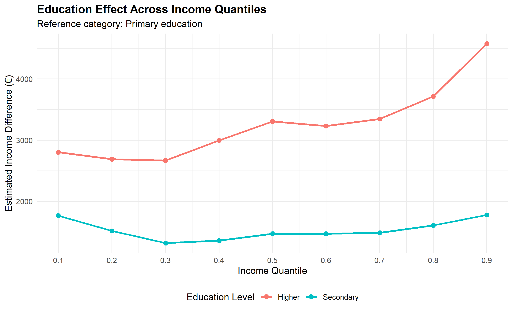
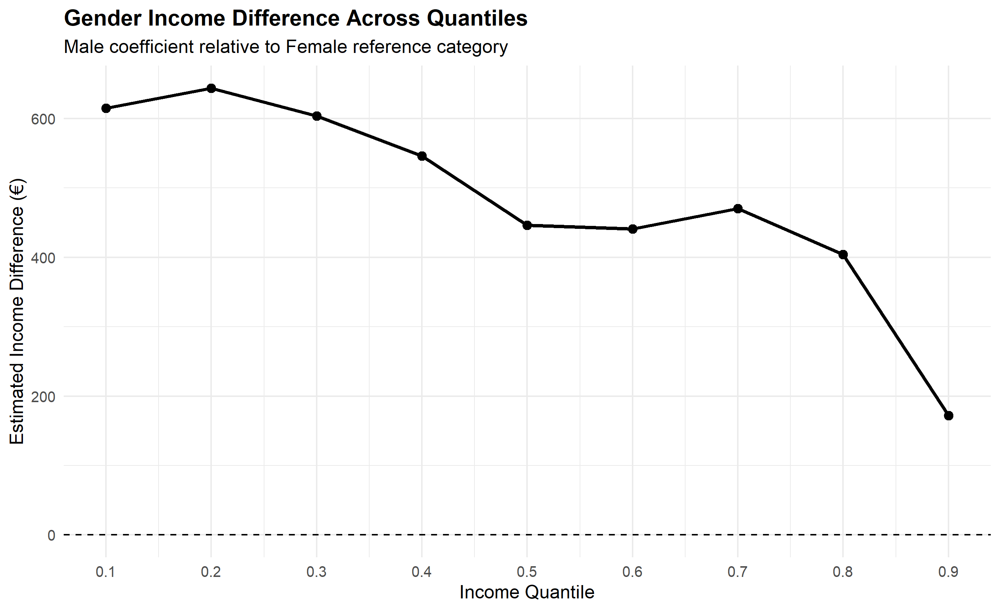
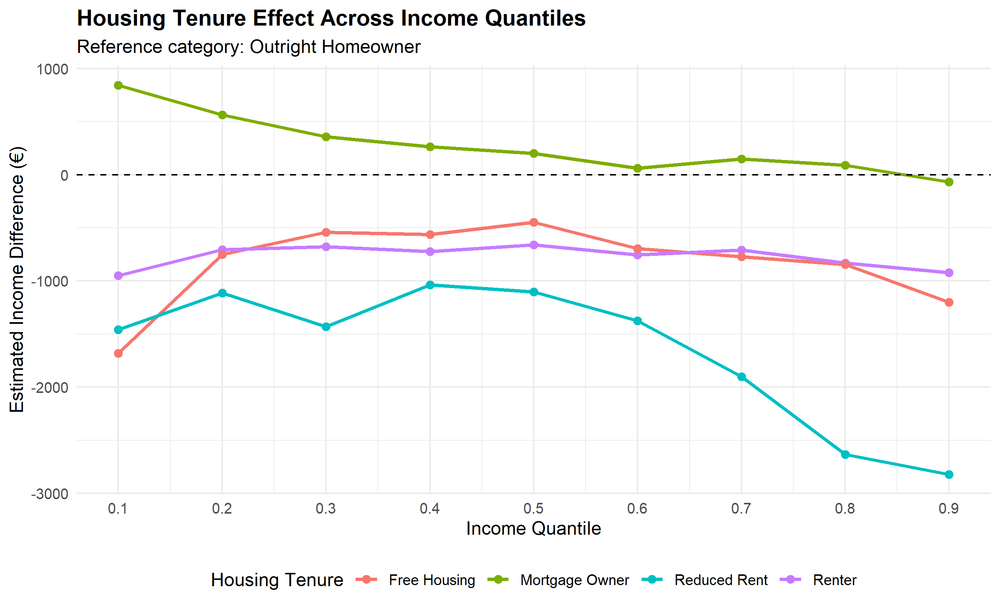

# Social stratification on income base

Quantitative analysis of income inequality in Slovakia using **R** and **quantile regression** to examine how socioeconomic factors are associated with income across different parts of the income distribution.

The project is based on my bachelor's thesis in Economics and Management of Public Administration at the Technical University of Košice.

## Project Overview

Traditional regression methods focus primarily on the average relationship between variables. This project uses **quantile regression** to investigate whether socioeconomic factors have different associations with income at different points of the income distribution.

The analysis examines **5,542 respondents from Slovakia** using EU-SILC 2020 microdata and focuses on four key socioeconomic characteristics:

- Age
- Gender
- Education level
- Housing tenure

The dependent variable is **equivalized disposable household income**.

## Research Question

How are demographic and socioeconomic characteristics associated with household income, and how do these relationships differ across the income distribution?

## Tools & Methods

- **R**
- **dplyr** — data preparation and transformation
- **quantreg** — quantile regression
- **ggplot2** — data visualization
- **broom** — model output processing
- Quantile regression at **τ = 0.1–0.9**
- Bootstrap-based statistical inference
- Data cleaning and categorical variable recoding

## Key Findings

### 1. Education shows a strong and consistent association with income

Higher education was positively and statistically significantly associated with income across all analyzed quantiles. The estimated income difference for respondents with higher education relative to the primary-education reference group increased from approximately **€2,803 at the 10th percentile to €4,577 at the 90th percentile**.

This suggests that the income advantage associated with higher education becomes particularly pronounced toward the upper end of the income distribution.

### 2. The gender income difference narrows toward the top of the distribution

With women used as the reference category, the estimated coefficient for men was positive across the income distribution. The difference was approximately **€615 at the 10th percentile** and **€446 at the median**, before declining further at higher quantiles.

At the 90th percentile, the estimated difference was no longer statistically significant.

### 3. Housing tenure is strongly associated with income

Compared with outright homeowners, renters showed negative income coefficients across all analyzed quantiles.

Reduced-rent housing was associated with particularly large negative coefficients, especially toward the upper end of the income distribution. Mortgage owners showed positive coefficients primarily at lower quantiles, while the relationship became statistically insignificant across much of the middle and upper distribution.

### 4. The relationship between age and income varies across the distribution

Age showed a heterogeneous relationship with income. The coefficient was positive at the 10th percentile, statistically insignificant at the 20th percentile, and increasingly negative from the 30th through the 90th percentile.

This variation demonstrates why quantile regression can reveal patterns that may be obscured when focusing only on average effects.

## Data Availability

The original **EU-SILC 2020 microdata are not included in this repository due to data access and confidentiality restrictions**.

The repository contains the R analysis code, aggregated regression results, and visualizations derived from the research. No respondent-level microdata are published.

## Repository Contents

- `R/quantile_regression_analysis.R` — data preparation and quantile regression workflow
- `R/visualize_results.R` — visualization of aggregated regression results
- `results/quantile_regression_results.csv` — aggregated model coefficients and statistical significance
- `images/` — visualizations of the main results

## Skills Demonstrated

**R · Data Cleaning · Statistical Analysis · Quantile Regression · Econometrics · Data Visualization · Statistical Inference · Research**

## Author

**Volodymyr Yavdoshniak**  
B.Sc. in Economics and Management of Public Administration  
Technical University of Košice
